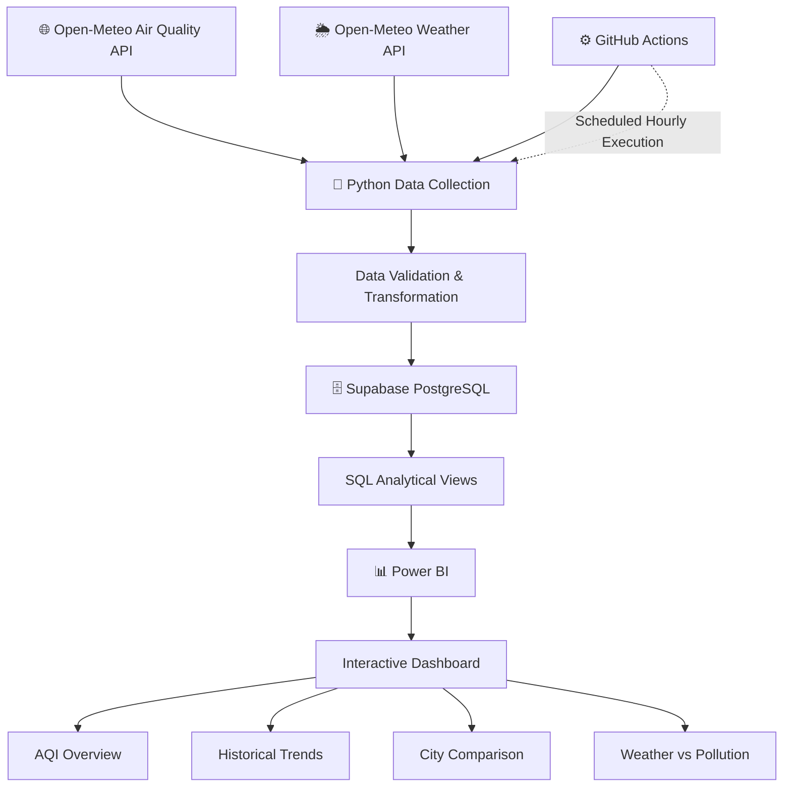

# 🌍 Real-Time Air Quality Analytics Dashboard


> **An automated data analytics pipeline for monitoring air quality and weather conditions across major Indian cities using Python, REST APIs, PostgreSQL, GitHub Actions, SQL, and Power BI.**

---

## 📌 Project Overview

The **Real-Time Air Quality Analytics Dashboard** is an end-to-end data analytics project designed to collect, store, analyze, and visualize air-quality and weather data across major Indian cities.

The system automatically collects environmental data through APIs, processes the data using Python, stores historical observations in PostgreSQL, and updates the database automatically using GitHub Actions.

The processed data is then connected to **Power BI** to create interactive dashboards for:
- AQI monitoring
- City-level pollution comparison
- Historical pollution trends
- PM2.5 and PM10 analysis
- Weather vs pollution analysis
- Correlation analysis
- City rankings

The project demonstrates a complete analytics workflow from **API data collection → ETL → SQL → Cloud Database → Automation → Business Intelligence**.

---

## 🎯 Objectives

The main objectives of this project are:

- Monitor air quality across major Indian cities.
- Collect AQI and pollutant-level data automatically.
- Combine pollution data with weather conditions.
- Store historical observations for trend analysis.
- Automate the data pipeline using GitHub Actions.
- Perform SQL-based data transformation and analysis.
- Build interactive Power BI dashboards.
- Identify relationships between weather variables and pollution levels.

---

# 🏗️ System Architecture



---

## 🔄 Data Flow

```text
Open-Meteo APIs
      ↓
Python Data Collection
      ↓
Data Processing & Validation
      ↓
Supabase PostgreSQL
      ↓
SQL Analytical Views
      ↓
Power BI
      ↓
Interactive Analytics Dashboard
```

---

## 📊 Dashboard Pages

- AQI Overview – AQI KPIs, city ranking, map, and current pollution levels.
- Historical Trends – AQI, PM2.5, PM10, and time-based trends.
- City Comparison – Compare pollution levels and rank cities.
- Weather & Pollution – Analyze relationships between AQI, PM2.5, wind speed, humidity, and temperature.

---

## 🛠️ Tech Stack

| Category        | Tools                |
| --------------- | -------------------- |
| Language        | Python               |
| Data Analysis   | Pandas, NumPy        |
| Data Collection | REST APIs, Requests  |
| Database        | PostgreSQL, Supabase |
| Analytics       | SQL, DAX             |
| Visualization   | Power BI             |
| Automation      | GitHub Actions       |
| Version Control | Git, GitHub          |

---

## 🌆 Cities Covered

The dashboard currently monitors the following Indian cities:

- Delhi
- Mumbai
- Bengaluru
- Chennai
- Kolkata
- Hyderabad
- Pune
- Ahmedabad
- Bhopal
- Indore

---

## ⚙️ Automation

GitHub Actions automatically runs the Python data collection pipeline on a scheduled basis and stores the collected observations in the cloud PostgreSQL database.
sequenceDiagram
    participant G as GitHub Actions
    participant P as Python
    participant A as Open-Meteo
    participant DB as PostgreSQL

    G->>P: Run scheduled pipeline
    P->>A: Request AQI & weather data
    A-->>P: Return data
    P->>DB: Insert / update records
    DB-->>P: Confirm transaction
